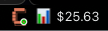
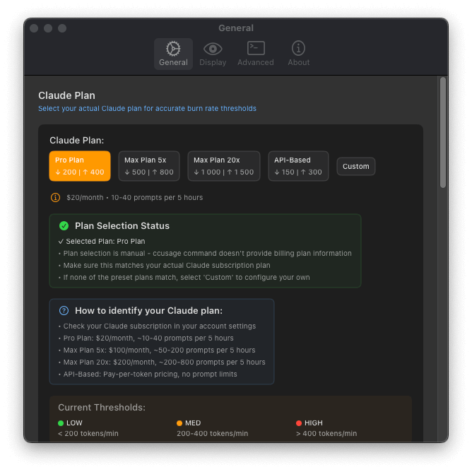
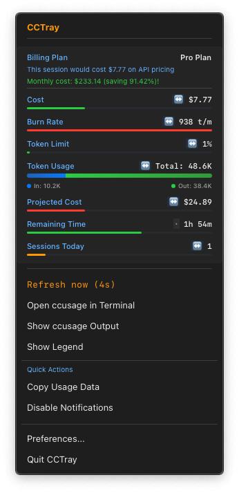
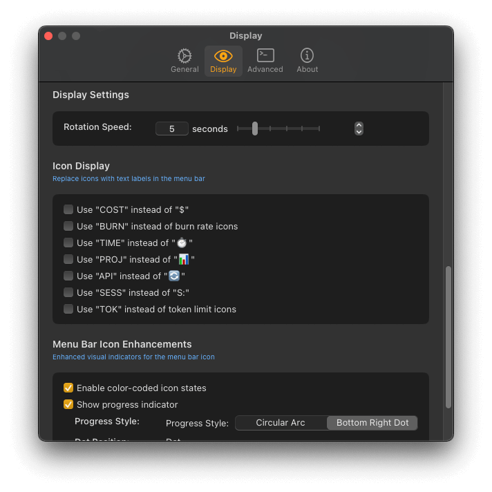

# 
```
 ██████╗  ██████╗ ████████╗ ██████╗   █████╗  ██╗   ██╗
 ██╔════╝ ██╔════╝ ╚══██╔══╝ ██╔══██╗ ██╔══██╗ ╚██╗ ██╔╝
 ██║      ██║         ██║    ██████╔╝ ███████║  ╚████╔╝
 ██║      ██║         ██║    ██╔══██╗ ██╔══██║   ╚██╔╝
 ╚██████╗ ╚██████╗    ██║    ██║  ██║ ██║  ██║    ██║
  ╚═════╝  ╚═════╝    ╚═╝    ╚═╝  ╚═╝ ╚═╝  ╚═╝    ╚═╝
```
[](https://github.com/goniszewski/cctray/actions)
[](https://github.com/goniszewski/cctray/releases)
[](https://opensource.org/licenses/MIT)

A macOS menu bar application that monitors Anthropic's Claude API usage in real-time. It provides instant visibility into your AI development costs and usage patterns, inspired by the excellent command-line tool [ccowl](https://github.com/sivchari/ccowl).

> **✨ Fun Fact:** This application was developed almost exclusively using Anthropic's Claude.

## 🚀 Features

- **Dynamic Menu Bar Icon**: The app icon provides at-a-glance insights with:
    - **Color-Coded States**: Green (normal), Yellow (warning), and Red (critical) based on your usage thresholds.
    - **Pulsing Animation**: A subtle pulse warns you when you're approaching limits.
    - **Mini Progress Arc**: A circular progress bar around the icon shows token usage percentage.
- **Rich Data Visualization**: The main view presents data visually for quick comprehension:
    - **Progress Bars**: See your token usage against limits.
    - **Trend Indicators**: Small arrows (↗️ ↘️ ↔️) show if your usage is increasing, decreasing, or stable.
    - **Sparkline Charts**: Mini-graphs display recent usage patterns.
    - **Color-Coded Metrics**: Key numbers are colored based on semantic thresholds for instant understanding.
- **Quick Actions**: Access common tasks directly from the main menu:
    - Copy usage data to the clipboard.
    - Toggle critical notifications on/off.
    - Keyboard shortcuts for power users.
- **Real-time Monitoring**: Live tracking of Claude API usage via the `ccusage` CLI.
- **Smart Rotating Display**: Cycles through key metrics like cost, burn rate, and remaining session time right in your menu bar.
- **Deep Customization**: A comprehensive four-tab preferences window lets you control everything from refresh rates to visual thresholds.
- **Robust & Efficient**: Features intelligent error handling, automatic Node.js path detection, and is optimized for minimal resource usage.

## 📱 Screenshots

Here are a few glimpses of CCTray in action. For more, check out the full [screenshots directory](screenshots).

|               Menu Bar Icon & Dropdown                |                             Preferences                              |
| :---------------------------------------------------: | :------------------------------------------------------------------: |
|  |  |
|            *Real-time usage at a glance.*             |                    *Customize general settings.*                     |
|   |  |
|        *Quick actions from the context menu.*         |                      *Fine-tune what you see.*                       |

## 🎯 Requirements

- **macOS 13.0+** (Ventura or later)
- **Node.js** (any version with npm)
- **ccusage CLI tool** (`npm install -g ccusage`)

## 📦 Installation

#### 1. Install the CLI Dependency

First, ensure you have Node.js and install the `ccusage` CLI tool globally.

```bash
npm install -g ccusage
```

#### 2. Install CCTray

1.  Download the latest `CCTray.dmg` from the [Releases page](https://github.com/goniszewski/cctray/releases).
2.  Open the DMG and drag `CCTray.app` to your Applications folder.
3.  Launch CCTray.

## 🎮 Usage

### Basic Operation

1.  **Launch**: CCTray appears as an orange "C" in your menu bar.
2.  **Click**: View detailed usage information in the dropdown menu.
3.  **Rotating Display**: The menu bar icon cycles through cost → burn rate → remaining time.
4.  **Preferences**: Click "Preferences..." in the dropdown to customize settings.

### Menu Bar States

-   **💤**: No active Claude session.
-   **⏳**: Loading usage data.
-   **❌**: Error fetching data from `ccusage`.
-   **C $X.XX**: Current session cost.
-   **C XXX/min**: Current burn rate (tokens per minute).
-   **C XXmin**: Estimated time remaining in the session.

### Understanding Burn Rate Colors

-   **🟢 LOW**: < 300 tokens/min
-   **🟡 MEDIUM**: 300-700 tokens/min
-   **🔴 HIGH**: > 700 tokens/min

## ⚙️ Configuration

CCTray is highly customizable via the **Preferences** window, accessible from the menu bar dropdown.

You can configure:
-   **General:** Set the data refresh rate and toggle "Launch at Login".
-   **Display:** Control what information is shown (cost, burn rate, etc.), its rotation speed, and the color thresholds for burn rate warnings.
-   **Advanced:** Manually specify paths for your Node.js executable and the `ccusage` script if auto-detection fails.

## 🛠️ Development

### Building from Source

```bash
# Clone the repository
git clone https://github.com/goniszewski/cctray.git
cd cctray

# Open in Xcode and run
open CCTray.xcodeproj
```

### Running Tests

```bash
# Run unit tests from the command line
xcodebuild test -project CCTray.xcodeproj -scheme CCTray -destination 'platform=macOS'

# Or, run all tests in Xcode using the shortcut Cmd+U
```

### Architecture Overview

CCTray follows modern SwiftUI patterns, including MVVM architecture, actor-based services for safe concurrency, and `@AppStorage` for persistent state management.

-   `UsageMonitor`: Core business logic and data fetching.
-   `CommandExecutor`: Secure shell command execution with caching.
-   `AppPreferences`: User settings with persistent storage.
-   `PreferencesView`: The four-tab settings interface.

## 🔧 Troubleshooting

#### "Command not found" or Menu Bar shows "❌"

This usually means CCTray cannot find or execute the `ccusage` command.

1.  **Verify `ccusage`:** Open Terminal and run `ccusage --version`. If this fails, reinstall it with `npm install -g ccusage`.
2.  **Check Node.js Path:** CCTray automatically detects Node.js installations from Homebrew, nvm, and standard system paths. If you have a custom setup, you may need to set the path manually.
    -   Find your Node.js path: `which node`
    -   Go to CCTray **Preferences → Advanced** and paste the full path into the "Node.js Command" field.
3.  **Check `ccusage` Path:** If you installed `ccusage` in a non-standard location, you can also specify its path in the Advanced preferences.
    -   Find your `ccusage` path: `npm list -g ccusage`
    -   Copy the path to the main script (e.g., `.../lib/node_modules/ccusage/dist/index.js`) and paste it into the "ccusage Script" field.

#### High CPU Usage

-   Increase the **Update Interval** in **Preferences → General** to a higher value (e.g., 10-15 seconds). CCTray uses exponential backoff during errors to prevent high CPU usage, but frequent updates can still be resource-intensive.

## 🤝 Contributing

Contributions are welcome! Please feel free to fork the repository, make changes, and open a pull request.

1.  Fork the repository.
2.  Create a feature branch (`git checkout -b feature/amazing-feature`).
3.  Commit your changes following the convention below.
4.  Push to the branch (`git push origin feature/amazing-feature`).
5.  Open a Pull Request.

### Commit Messages

This project uses [Conventional Commits](https://www.conventionalcommits.org/en/v1.0.0/). Please structure your commit messages accordingly. This helps in automating changelogs and makes the history more readable.

**Examples:**
-   `feat: Add new burn rate color option`
-   `fix: Correctly parse cost from JSON output`
-   `docs: Update README with installation instructions`
-   `refactor: Improve performance of data fetching service`

## 🙏 Acknowledgements

-   This project was heavily inspired by the functionality of [ccowl](https://github.com/sivchari/ccowl) by [@sivchari](https://github.com/sivchari).

## 📄 License

This project is licensed under the MIT License - see the [LICENSE](LICENSE) file for details.

---

**Made with ❤️ for the Claude community**
